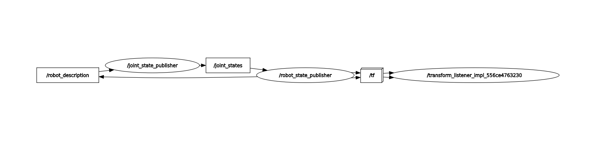

# URDF (Unified Robot Description Format)

# rpy

1. roll is the rotation on x axis
2. pitch is the rotation on y axis
3. yaw is the rotation on z axis

# create basic urdf file

```bash

<?xml version="1.0" ?>
<robot name="my_robot">
    <link name="base_link">
        <visual>
            <geometry>
                <box size="0.6 0.4 0.2"/>
            </geometry>
            <origin xyz="0 0 0" rpy="0 0 0" />
        </visual>
    </link>
</robot>
# Link is a rigid body
# open terminal and run this command
ros2 launch urdf_tutorial display.launch.py model:=/home/emon/development/ros2-beginners-level-2/CreateURDF/my_robot.urdf

### Joint TF .Joint need to relation between two frames where one is root link and another is child link.

### In Joint tag required a parent tag and chiled tag
    <joint name="base_second_joint" type="fixed" >
        <parent link="base_link"/>
        <child link="second_link"/>
        <origin xyz="0 0 0" rpy="0 0 0"/>
    </joint>


```

### Fixed joint create relation between two links which is not moveable

### TO know about urdf/xml tag to follow ros-wiki urdf xml document.

```bash
# To rotate the joint in z axis joint code :

    <joint name="base_second_joint" type="revolute" >
        <parent link="base_link"/>
        <child link="second_link"/>
        <origin xyz="0 0 0.2" rpy="0 0 0"/>
        <axis xyz="0 0 1"/>
        <limit lower="-1.57" upper="1.57" velocity="100" effort="100"/>
    </joint>
    # here xyz="0 0 1" means joint rotate z axis .

    # If  i want to rotate it with x axis then the value of xyz="1 0 0"


```

### In continuous type joint no need to any limit .This type of joint need to rotate wheel.

## Robot state publisher and URDF work together

```bash
#1 to view frames of tf and connect between link and joint
ros2 run tf2_tools view_frames -o robot_wheel.urdf

#2 To see rqt graph
rqt_graph

```



```bash
ros2 topic list
# See /joint_states and tf topics
ros2 topic echo /joint_states

```

## RUN the robot state publisher with URDF in the terminal (command line)

```bash
# instal xacro
sudo apt install ros-humble-xacro

ros2 run robot_state_publisher robot_state_publisher --ros-args -p robot_description:="$(xacro urdf_file)"

# TO load joint_state_publisher of robot install gui package
sudo apt install ros-humble-joint-state-publisher-gui
# Run this package
ros2 run joint_state_publisher_gui joint_state_publisher_gui
# Start rviz simulation
ros2 run rviz2 rviz2

# This is the process to run urdf with urdf_turotial package

```

# Ros2 create robot description package with urdf

```bash
mkdir ros2_ws
cd ros2_ws
mkdir src
cd ros2_ws
colcon build
source install/setup.bash
cd ros2_ws/src

# then run
ros2 pkg create my_robot_description
# Then cd to my_robot_description and remove include and src folder
# create urdf folder
```
