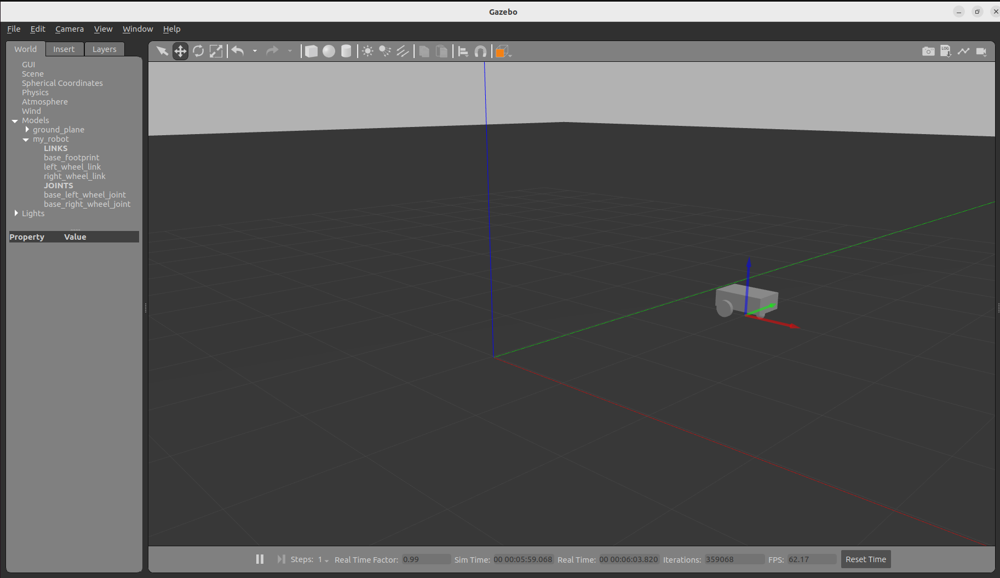

# Create launch file start robot state publsiher with URDF

```bash
<launch>
    <let name="urdf_path"
         value="$(find-pkg-share my_robot-description)/urdf/robot-wheel.urdf" />
    <node pkg="robot_state_publisher" exec="robot_state_publisher">
         <param name="robot_description"
                value="$(command 'xacro $(var urdf_path)')"/>
    </node>

    <node pkg="joint_state_publisher_gui" exec="joint_state_publisher_gui"/>

    <node pkg="rviz2" exec="rviz2" output="screen"/>
</launch>
# Here in let tag find urdf file path in pkg  and use this as parameter of value of robot_description
cd ros2_ws
colcon build
 ros2 launch my_robot-description display.launch.xml

```

## Add default Robotmodel and Tf in rviz config

1. save rviz file to any directory
2. Apply below command

```bash
ros2 run rviz2 rviz2 -d ~/Documents/my_robot.rviz


```

## Add Rivz config in launch file

1. create rviz folder in pkg directory
2. paste config file in this folder
3. Add in CMakelists install rviz

```bash
# create variable for rviz path
     <let name="rviz_config"
          value="$(find-pkg-share my_robot-description)/rviz/my_robot.rviz"/>
# Add this variable in rviz node as a arguments
 <node pkg="rviz2" exec="rviz2"  output="screen"
          args="-d $(var rviz_config)"
    />

```

# Make the URDF Compatible with xacro

### Install xacro

```bash
sudo apt install ros-humble-xacro
```

1. Rename the Urdf file with "urdf.xacro" extension or just "xacro" extnsion
2. changes in urdf file in robot start tag as like :

```bash
<robot name="my_robot" xmlns:xacro="http://www.ros.org/wiki/xacro">

```

3. Rename urdf file path in launch file and again colcon build.

# Create Veraible with Xacro properties

```bash
  <xacro:property name="base_length" value="0.6"/>

```

# Create Functions with xacro macros

```bash
# create macro with dynamic params
    <xacro:macro name="example_macro" params="a b c">
        <link  name="dummy">
            <visual>
                <geometry>
                    <box size="${a} ${b} ${c}"/>
                </geometry>
            </visual>
        </link>
    </xacro:macro>
    #call macro
    <xacro:example_macro a="2" b="3" c="4"/>

```

# Include a xacro file in another xacro file

```bash

 <xacro:include filename="common_properties.xacro" />
 # in common_properties file define the common things of robot_wheel.urdf file
 <?xml version="1.0"?>
    <robot xmlns:xacro="http://www.ros.org/wiki/xacro">

        <material name="blue">
            <color rgba="0 0 0.5 1" />
        </material>

        <material name="grey">
            <color rgba="0.5 0.5 0.5 1" />
        </material>
        <xacro:macro name="box_inertia" params="m l h w xyz rpy">
            <inertial>
                <origin xyz="${xyz}" rpy="${rpy}"/>
                <mass value="${m}"/>
                <inertia ixx="${(m/12) * (h*h + l*l)}" ixy="0" ixz="0"
                iyy="{$(m/12) * (w*w + h*h)}" iyz="0"
                izz="{$(m/12 * (w*w + l*l)}"/>
            </inertial>
        </xacro:macro>

    </robot>
# In robot tag there is no need any name attribute

```

# Spawn The robot in gazebo

1. Open the 4 terminal
2. In 1st terminal and run

```bash
 ros2 run robot_state_publisher robot_state_publisher --ros-args -p robot_description:="$(xacro ~/development/ros2-beginners-level-2/ros2_ws/src/my_robot-description/urdf/robot-wheel.urdf.xacro)"


```

3. In 2nd terminal

```bash
# First try this command and open gazebo
ros2 launch gazebo_ros gazebo.launch.py
# If not work then try
gazebo --verbose -s libgazebo_ros_factory.so
```

4. In 3rd terminal

```bash
ros2 topic list

/clock
/joint_states
/parameter_events
/robot_description
/rosout
/tf
/tf_static

```

5. In 4th terminal

```bash
 ros2 run gazebo_ros spawn_entity.py -topic robot_description -entity my_robot
```

#### Hurrah ! Finally urdf model export in gazebo



# Add Gazebo plugin to control the robot 
```bash

    <gazebo>
        <plugin name="diff_drive_contorller" filename="libgazebo_ros_diff_drive.so">

            <!-- Update rate in Hz -->
            <update_rate>50</update_rate>
    
            <!-- wheels -->
            <left_joint>base_left_wheel_joint</left_joint>
            <right_joint>base_right_wheel_joint</right_joint>
    
            <!-- kinematics -->
            <wheel_separation>0.45</wheel_separation>
            <wheel_diameter>0.2</wheel_diameter>

    
            <!-- output -->
            <publish_odom>true</publish_odom>
            <publish_odom_tf>true</publish_odom_tf>
            <publish_wheel_tf>true</publish_wheel_tf>
    
            <odometry_topic>odom</odometry_topic>
            <odometry_frame>odom</odometry_frame>
            <robot_base_frame>base_footprint</robot_base_frame>
    
        </plugin>
    </gazebo>


```
# Move Robot in gazebo 

1. Launch Rviz 
```bash
 ros2 launch my_robot-description display.launch.xml
```
2. Launch gazebo 
```bash
gazebo --verbose -s libgazebo_ros_factory.so

```
3. Spawn Robot entity 
```bash
ros2 run gazebo_ros spawn_entity.py -topic robot_description -entity my_robot

```
4. Run command line value to run the robot 
```bash
ros2 topic list 

ros2 interface show geometry_msgs/msg/Twist

ros2 topic pub /cmd_vel geometry_msgs/msg/Twist "{linear: {x: 0.5}, angular: {z: 0}}"


```
### Now robot is complete 